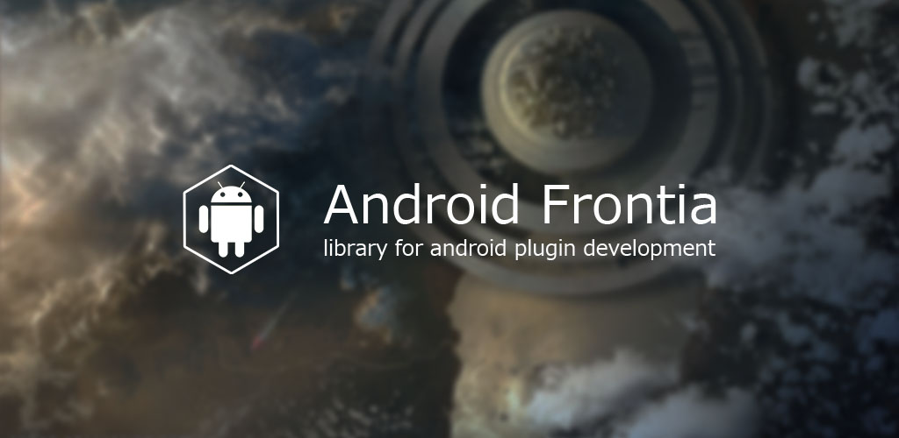

#### Frontia
Android-Frontia是一个Android的插件化框架（基于ClassLoader的动态加载技术），相比其他开源项目，Frontia的特点是扩展性强，更加专注于插件的下载、更新、安装、管理，以及插件和宿主之间的交互。

Frontia的核心原理依然是以下两点：

- 使用ClassLoader加载插件的类；
- 使用Android SDK的隐藏API加载插件的res资源；

项目结构

| 文件夹        |     说明     |
| :----------- | :-----------|
| app-demo | 演示宿主APP |
| frontia | Frontia Library |
| video-behaviour | 演示视频插件接口 |
| video-plugin | 演示视频插件 |

如果需要运行项目，请先编译 frontia 模块和 behaviour 模块。

#### FEATURE
- 实现了插件下载、更新逻辑（插件版本控制）；
- 实现了插件的安装（插件管理）；
- 实现了插件的加载逻辑（插件使用）；
- 实现插件的签名校验（插件安全）；
- 插件的更新、安装以及加载分别由各自的类负责，可以通过重写这些类来实现自定义的逻辑（具有高扩展性）；
- 多种插件化方式，比如“类替换”、“加载SO库”、“加载Fragment”、“加载Activity/Service组件”（满足不同业务情景）；
- 使用插件行为接口来控制加载的插件，不直接使用反射；
- 提供插件调用宿主功能的HostApi接口，插件可以通过这些接口访问宿主的API；

#### TODO
- [x] 支持Assets内置插件；
- [x] 支持res资源的插件；
- [x] 支持SO库的插件；
- [ ] 支持新建基础组件的插件（Activity等）；
- [x] 插件下载和更新（PluginUpdater）；
- [x] 插件安装（PluginInstaller）；
- [x] 插件加载（PluginLoader）；
- [x] 增加Config类，支持自定义；
- [ ] 添加AndroidTestCase；
- [ ] 完善DEMO项目；
- [ ] 添加Usage演示代码；
- [x] 插件与宿主间的通讯（HostApiManager）；
- [x] 优化插件安装策略（减少文件操作，提高稳定性）；
- [x] 优化下载逻辑（多线程下载，断点续传）；
- [x] 代码格式优化，结构优化；
- [x] 优化插件管理类(PluginManaer);
- [ ] 处理依赖统一问题，如插件Support库依赖问题；
- [ ] 插件MultiDex支持；
- [x] 插件安全校验；
- [x] 失败重试机制；
- [ ] 插件Router通信机制；
- [x] PluginBehavior、HostApi动态代理保护；
- [ ] 同步优化（线程锁、文件锁）；
- [ ] so库分包支持；
- [x] 插件Entry优化；
- [x] Plugin、PluginBehavior泛型支持；
